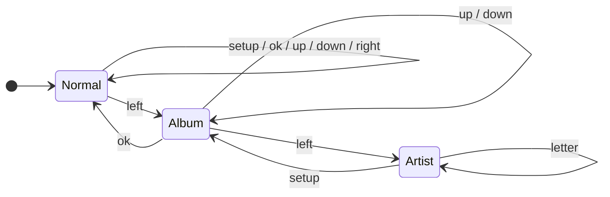
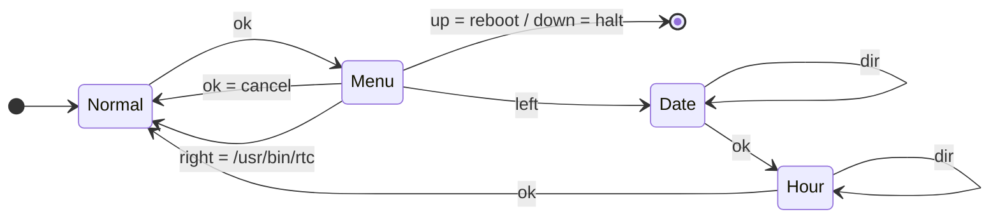
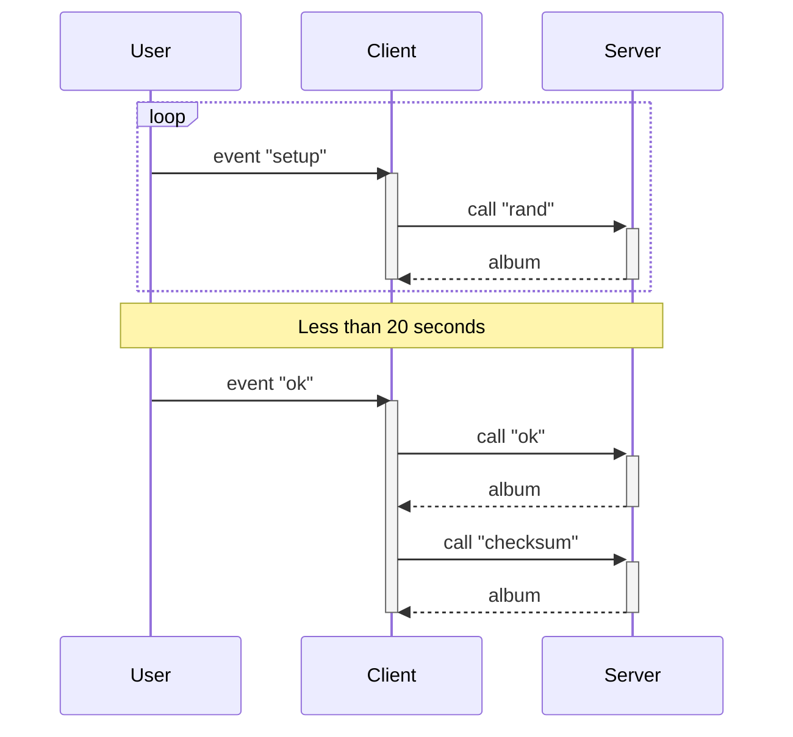

# Install
[libjsonrpccpp](../libjsonrpccpp/README.md)

[libmraa](../libmraa/README.md)

[libupm](../libupm/README.md)
```sh
make xbuild
make xpackage
make xdeploy
```
```sh
make reinstall
```

# Structure of album directories
`music_directory/additional_directory/artist - year - album/00.m3u`

`music_directory` :
from /etc/mpd.conf

`additional_directory` :
to use weights in random selection of albums,
weights will be in music_directory/mps.weights

# [Client state diagram](README-0.md)


# [Screensaver state diagram](README-0.md)


# [Main sequence diagram](README-0.md)


# Create chroot

```console
localhost> cd ../hosts/debian13
localhost> make up
localhost> make add-ip
localhost> vagrant halt
localhost> make up
localhost> vagrant provision
localhost> make ssh-copy-id  # for rsync in sbuild.yml
localhost> vagrant ssh
 vagrant1> mkdir ~/sbuild
 vagrant1> DIST=stable
 vagrant1> ARCH=armhf  # nanopi-neo:armhf orange-pi-zero:arm64 rockpi-s:arm64
 vagrant1> sudo mkdir /temp
 vagrant1> sudo chmod 777 /temp
 vagrant1> export TMPDIR=/temp
 vagrant1> mmdebstrap --variant=buildd --architectures=$ARCH $DIST ~/sbuild/$DIST-$ARCH.tar.xz --include=cmake,debhelper,fakeroot,help2man,pkg-config,lintian,dose-distcheck,apt-utils,libargtable2-dev,libcurl4-openssl-dev,libjsoncpp-dev,libmicrohttpd-dev,libmpdclient-dev,liblirc-dev,swig,python3-dev
```

# Release

```console
 vagrant1> sudo apt install libmpdclient-dev liblirc-dev
localhost> make BUILDER=sbuild rbuild
localhost> make BUILDER=sbuild rpackage
localhost> make BUILDER=sbuild rxpackage OPTS='-e ARCH=armhf'
```

<details>
  <summary><s>Release with pbuilder</s></summary>

  ```console
  localhost> cd ../hosts/debian12
  localhost> vagrant ssh
   vagrant1> cd ~/pbuilder/*_result
   vagrant1> python3 -m http.server
   vagrant2> sudo apt install libmpdclient-dev liblirc-dev
   vagrant2> cd ~/pbuilder/*_result
   vagrant2> pbuilder-dist bookworm armhf update --extrapackages 'libmpdclient-dev liblircclient-dev' --allow-untrusted --othermirror 'deb [allow-insecure=yes] http://localhost:8000/ ./'

  localhost> sudo apt install libmpdclient-dev liblirc-dev
  localhost> make BUILDER=pbuilder build
  localhost> make BUILDER=pbuilder package

  localhost> make BUILDER=pbuilder rbuild
  localhost> make BUILDER=pbuilder rpackage
  localhost> make BUILDER=pbuilder rxpackage OPTS='-e ARCH=armhf'
   vagrant2> cp -av libmraa2_2.2.0-1_armhf.deb libupm-lcd2_2.0.0-1_armhf.deb libjsonrpccpp-client0_1.4.1-1.0_armhf.deb libjsonrpccpp-common0_1.4.1-1.0_armhf.deb libjsonrpccpp-server0_1.4.1-1.0_armhf.deb mps_1.0.0_armhf.deb /vagrant/.vagrant
  localhost> user=$USER
  localhost> host=pi
  localhost> scp .vagrant/*.deb $user@$host:/tmp/
  localhost> ssh $user@$host
   remotepi> cd /tmp
   remotepi> sudo apt reinstall ./*.deb
  ```
</details>

## Update sysroot for cross compilation
```console
 vagrant2> cp -av *-dev_* /vagrant/.vagrant
localhost> user=$USER
localhost> host=pi
localhost> ssh $user@$host
 remotepi> cd /run/user/1000
localhost> scp .vagrant/*-dev_* $user@$host:/run/user/1000/
 remotepi> sudo apt reinstall ./*-dev_*
```
[update](../libjsonrpccpp/README.md#sysroot-installation)

# Divers

<details>
  <summary>Test without arm</summary>

  ```console
  terminal1> make build
  terminal1> make server
  terminal2> make client  # KEY_SETUP, KEY_OK, ...
  terminal3> make dir path=
  terminal3> ./client.py
  terminal3> ./client.py [method]  # rand, ok, ...
  terminal3> ./client.py quit
  ```
</details>

<details>
  <summary>php usage</summary>

  ```console
  terminal1> make tunnel
  terminal2> make php
  ```
</details>

<details>
  <summary>music_directory update</summary>

  ```sh
  mpc update
  rm mps.list
  sudo systemctl restart mpserver
  ```
</details>

<details>
  <summary>manpages update</summary>

  ```sh
  make
  cp build/*.1 .
  ```
</details>

<details>
  <summary>No apt list update</summary>

  ```sh
  sudo mv /etc/apt/apt.conf.d/02-armbian-postupdate ~/
  ```
</details>

<details>
  <summary>mpc usage for debug</summary>

  ```sh
  mpc --host=/run/mpd.sock clear
  mpc --host=/run/mpd.sock load 'music_directory/.../00.m3u'
  mpc --host=/run/mpd.sock play
  ```
</details>

[gitlab](../hosts/gitlab/README.md)

# BOM 2021
[pdf](http://beaugrand.chez.com/pdf/remoteControl.pdf)

# BOM 2025
|Article|TTC|Nombre|Total|
|-------------------------------------------------------------------------------------------------------------|-----:|:-----:|-----:|
|[Platine sans cuivre 100x160mm](https://www.conrad.fr/fr/search.html?search=529569)                          |  3.99|1      |  3.99|
|[Connecteur femelle pour CI 32 contacts](https://fr.rs-online.com/web/p/connecteurs-femelles-pour-ci/1803928)| 19.00|39/32/5|  4.63|
|[Barrette mâle 40 pôles 12.50](https://www.conrad.fr/fr/search.html?search=1390110)                          |  3.80|1/5    |  0.76|
|[Barrette femelle 20 pôles coudée](https://www.conrad.fr/fr/search.html?search=1560681)                      |  3.99|15/20  |  2.99|
|[Barrette femelle 36 pôles droite](https://www.conrad.fr/fr/search.html?search=1560794)                      |  4.29|22/36  |  2.62|
|[Connecteur USB mâle coudé](https://www.conrad.fr/fr/search.html?search=1567163)                             |  3.29|1      |  3.29|
|[Connecteur USB femelle coudé](https://www.conrad.fr/fr/search.html?search=1567164)                          |  3.29|1      |  3.29|
|[Entretoise M3 25mm acier galvanisé](https://www.conrad.fr/fr/search.html?search=521678)                     |  2.99|4/10   |  1.20|
|[Entretoise M3 15mm Polyamide](https://www.conrad.fr/fr/search.html?search=2163259)                          |  3.08|2/7    |  0.88|
|[Vis M3 6mm Polyamide](https://www.conrad.fr/fr/search.html?search=1817006)                                  |  9.99|8/200  |  0.40|
|[Module RTC](https://www.conrad.fr/fr/search.html?search=2481842)                                            |  9.99|1/2    |  5.00|
|[Récepteur infrarouge 1838](https://www.conrad.fr/fr/search.html?search=1572283)                             |  1.79|1/2    |  0.90|
|[Embase d'alimentation 2.1mm 5.5mm](https://www.conrad.fr/fr/search.html?search=735754)                      |  1.84|1/2    |  0.92|
|[Bloc d'alimentation 12V 1A](https://www.conrad.fr/fr/search.html?search=3397133)                            | 10.99|1      | 10.99|
|[Carte SD A1](https://fr.rs-online.com/web/p/cartes-sd/2836581)                                              | 11.68|1      | 11.68|
|[Condensateur 1000uF 16V 10x16mm](https://www.conrad.fr/fr/search.html?search=443933)                        |  4.00|2/20   |  0.40|
|[Interrupteur à levier 2 x On/On](https://www.conrad.fr/fr/search.html?search=1589399)                       |  1.99|2      |  3.98|
|[Patte d'assemblage 100x15x2mm](https://www.bricorama.fr/search?q=3274590517126)                             |  1.10|3      |  3.30|
|[Patte d'assemblage 60x15x2mm](https://www.bricorama.fr/search?q=3274590517102)                              |  1.10|4      |  4.40|
|[Charnière 40x25mm entraxe 27mm](https://www.bricorama.fr/search?q=3505391042136)                            |  5.40|1/2    |  2.70|
|[NanoPi NEO-LTS soldered](https://fr.aliexpress.com/item/1005005383857521.html)                              | 21.55|1      | 21.55|
|[Ampli XH-M567 TPA3116D2](https://fr.aliexpress.com/item/1005004830515523.html)                              |  3.39|1      |  3.39|
|[Régulateur de tension LM2596](https://fr.aliexpress.com/item/1005005970782265.html)                         |  1.32|1      |  1.32|
|[OLED blanc 1.3 i2c gnd](https://fr.aliexpress.com/item/1005006862867338.html)                               |  2.42|1      |  2.42|
|Total                                                                                                        |136.27|       | 96.99|

|Alternatives|TTC|Nombre|Total|
|-------------------------------------------------------------------------------------------------------------|-----:|:-----:|-----:|
|[Connecteur femelle pour CI 36 contacts](https://fr.rs-online.com/web/p/connecteurs-femelles-pour-ci/5490026)| 34.23|8/36/5 |  1.27|
|[Entretoise filetée 15mm](https://fr.rs-online.com/web/p/entretoises-filetees/1026378)                       |  6.43|4/10   |  2.57|
|[Vis à tête Cylindrique Cruciforme M3 8mm](https://fr.rs-online.com/web/p/vis-a-metaux/1854437)              |  5.02|8/20   |  2.01|

# License CeCILL 2.1

Copyright Sébastien Beaugrand

This software is governed by the CeCILL license under French law and
abiding by the rules of distribution of free software. You can use,
modify and/or redistribute the software under the terms of the CeCILL
license as circulated by CEA, CNRS and INRIA at the following URL
"http://www.cecill.info".

As a counterpart to the access to the source code and rights to copy,
modify and redistribute granted by the license, users are provided only
with a limited warranty and the software's author, the holder of the
economic rights, and the successive licensors have only limited
liability.

In this respect, the user's attention is drawn to the risks associated
with loading, using, modifying and/or developing or reproducing the
software by the user in light of its specific status of free software,
that may mean that it is complicated to manipulate, and that also
therefore means that it is reserved for developers and experienced
professionals having in-depth computer knowledge. Users are therefore
encouraged to load and test the software's suitability as regards their
requirements in conditions enabling the security of their systems and/or
data to be ensured and, more generally, to use and operate it in the
same conditions as regards security.

The fact that you are presently reading this means that you have had
knowledge of the CeCILL license and that you accept its terms.
