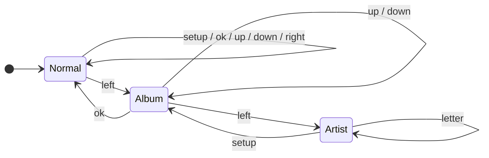
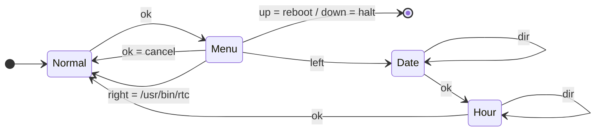

# Install
[libjsonrpccpp](../libjsonrpccpp/README.md)
```sh
vi data/*.service  # Use music_directory from /etc/mpd.conf
make xbuild
make xpackage
make xdeploy
```
```sh
make reinstall
```

# Structure of album directories
```
music_directory/additional_directory/artist - year - album/00.m3u
```
music_directory :
from /etc/mpd.conf

additional_directory :
to use weights in random selection of albums,
weights will be in music_directory/mps.weights

# Client state diagram


# Screensaver state diagram


# Divers

<details>
  <summary>Test without arm</summary>

  ```sh
  terminal1> make build
  terminal1> make server
  terminal2> make client  # KEY_SETUP, KEY_OK, ...
  terminal3> make dir path=
  terminal3> ./client.py
  terminal3> ./client.py [method]  # rand, ok, ...
  terminal3> ./client.py quit
  ```
</details>

<details>
  <summary>php usage</summary>

  ```sh
  terminal1> make tunnel
  terminal2> make php
  ```
</details>

<details>
  <summary>No apt list update</summary>

  ```sh
  sudo mv /etc/apt/apt.conf.d/02-armbian-postupdate ~/
  ```
</details>

<details>
  <summary>mpc usage for debug</summary>

  ```sh
  mpc --host=/run/mpd.sock clear
  mpc --host=/run/mpd.sock load 'music_directory/.../00.m3u'
  mpc --host=/run/mpd.sock play
  ```
</details>

# License CeCILL 2.1

Copyright Sébastien Beaugrand

This software is governed by the CeCILL license under French law and
abiding by the rules of distribution of free software. You can use,
modify and/or redistribute the software under the terms of the CeCILL
license as circulated by CEA, CNRS and INRIA at the following URL
"http://www.cecill.info".

As a counterpart to the access to the source code and rights to copy,
modify and redistribute granted by the license, users are provided only
with a limited warranty and the software's author, the holder of the
economic rights, and the successive licensors have only limited
liability.

In this respect, the user's attention is drawn to the risks associated
with loading, using, modifying and/or developing or reproducing the
software by the user in light of its specific status of free software,
that may mean that it is complicated to manipulate, and that also
therefore means that it is reserved for developers and experienced
professionals having in-depth computer knowledge. Users are therefore
encouraged to load and test the software's suitability as regards their
requirements in conditions enabling the security of their systems and/or
data to be ensured and, more generally, to use and operate it in the
same conditions as regards security.

The fact that you are presently reading this means that you have had
knowledge of the CeCILL license and that you accept its terms.
