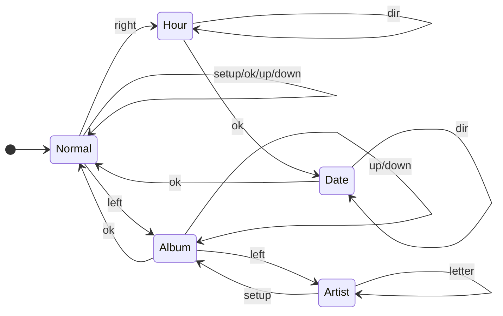

# Client state diagram

```mermaid
stateDiagram
    direction LR
    [*] --> Normal
    Normal --> Hour: right
    Normal --> Normal: setup/ok/up/down
    Hour --> Hour: dir
    Hour --> Date: ok
    Date --> Normal: ok
    Date --> Date: dir
    Normal --> Album: left
    Album --> Normal: ok
    Album --> Album: up/down
    Album --> Artist: left
    Artist --> Album: setup
    Artist --> Artist: letter
```
