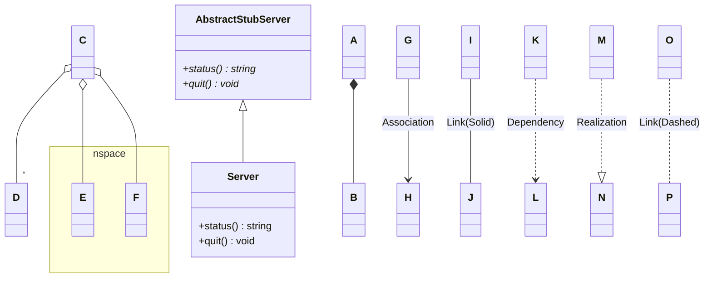
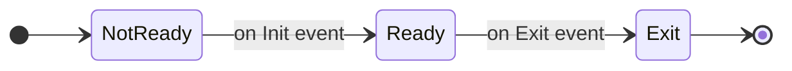

# [Mermaid class diagram example](README-0.md)

```mermaid
%% Mermaid class diagram example
classDiagram
class AbstractStubServer {
	+status()* string
	+quit()* void
}
class Server {
	+status() string
	+quit() void
}
AbstractStubServer <|-- Server
A *-- B
C o-- "*" D
namespace nspace {
	class E
	class F
}
C o-- E
C o-- F
G --> H : Association
I -- J : Link(Solid)
K ..> L : Dependency
M ..|> N : Realization
O .. P : Link(Dashed)
```

# [Mermaid state diagram example](README-0.md)

```mermaid
%% Mermaid state diagram example
stateDiagram
    direction LR
    [*] --> NotReady
    NotReady --> Ready: on Init event
    Ready --> Exit: on Exit event
    Exit --> [*]
```
